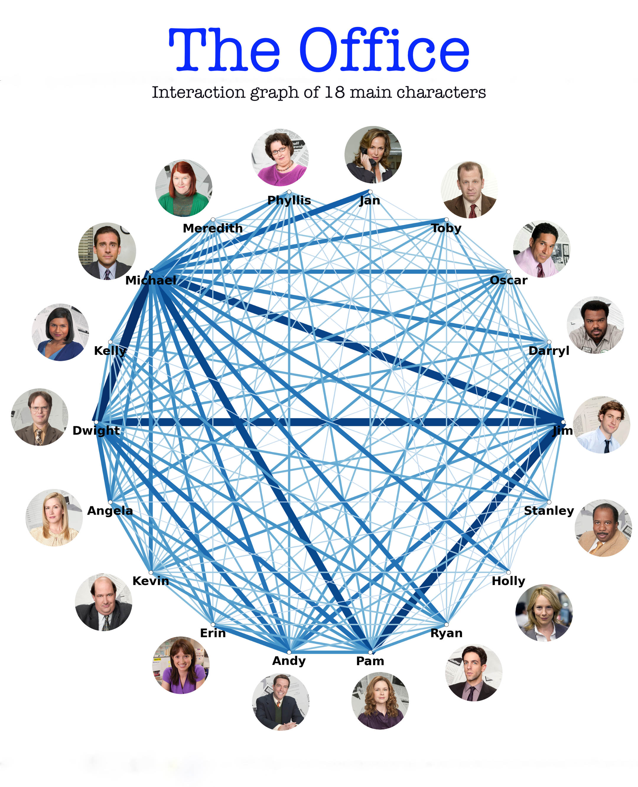

# The_Office_interactiongraph
Interaction graph of 18 main characters in The Office U.S using NetworkX 
#### This project is inspired by u/Gandagorn on Reddit 
https://www.reddit.com/user/Gandagorn/
#### The code was forked from Gandagorn with some modification
https://github.com/Gandagorn/interesting_visuals
#### Data from Nasir Khalid on Kaggle 
https://www.kaggle.com/nasirkhalid24/the-office-us-complete-dialoguetranscript/notebooks

